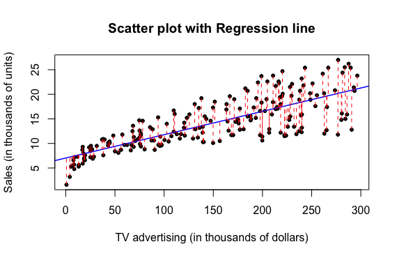

#                             Simple Regression Analysis
##                                    *Atul Lanka*
##                                   *Oct 07, 2016*

---

## Abstract

This report will perform regression analysis to reproduce the results computed and displayed in Section 3.1 *Simple Linear Regression* (Chapter 3) of the book **An Introduction to Statistical Learning**. This report will be divided into sections titled Introduction, Data, Methodology, Results and Conclusisons. At the end of this investigation, we should be abe to determine whether there exists a linear relationship between the TV Advertising budget and the subsequent sales for the product. 

---

## Introduction

The primary goal of this analysis is to determine a linear model that exists between TV advertising and sales in order to understand an overlying trend and provide advice on how to improve on sales. Furthermore, by determining a model between TV and sales, it can help us also project sales for other media outlets, which include Radio and Newspaper. 

---

## Data

The data used for this analysis is titled `Advertising.csv` and it consists of 4 columns - TV, Radio, Newspaper and Sales. The Sales column denotes the number of products sold in thousands of units, and the other columns denote the advertising budget in thousands of dollars for each of the three media outlets. 

---

## Methodology 

In order to observe a trend between media advertising and sales, the relationship between TV advertising and sales is studied first. The linear model for this relationship is as follows:

Y = $\beta_0$ + $\beta_1$*X

Y denotes the TV sales whiel X denotes TV advertising budget. In order to calculate the coefficients $\beta_0$ and $\beta_1$, the y-intercept and the gradient, we fit a linear regression model using the `lm()` function in R (least squares criterion). 

---

## Results

From the `lm()` function, the regression coefficients are summarized in this table:

Table 1: Information about Regression Coefficients

Coefficients| Estimate | Std. Error | t-statistic | p-value
------------|----------|------------|-------------|---------
Intercept   | 7.0325   | 0.4578     | 15.36       | <0.0001 (2.2e-16)
TV          | 0.0475   | 0.0027     | 17.67       | <0.0001 (2.2e-16)

 
  
Table 2: Regression Quality Indices

Quantity               | Value
-----------------------|-------
Residual Standard Error| 3.259
R-squared              | 0.612
F-statistic            | 312.1

Using the intercept and gradient values, a scatter plot is constructed with the regression line going through the points:

---

## Conclusions

From the table and the plots, it is evident that there exists a linear relationship between the TV advertising and sales - a positive correlation. Furthermore, the p-value is significantly small, which also means we can reject the null hypothesis, which is that there is no relationship between TV advertising and sales. So, a sure-fire strategy to increase sales would be to increase the spending of advertisements on television.  

The F-statistic tests the null hypothesis - there is no relationship between TV advertising and Sales. A high F-statistic of 312.1 would reject the null hypothesis and suggests that there is an association between the two. 

However, the RSE value is relatively large enough that there can be discrepancies in following the linear model (an error of 3259 sales). A low R-squared value (0.612) also suggests a weak fit. 

Based on all these assessments, there exists a positive correlation and to some extent, a linear relationship. However, it is not the most accurate fit, and a more flexible model might be required.

